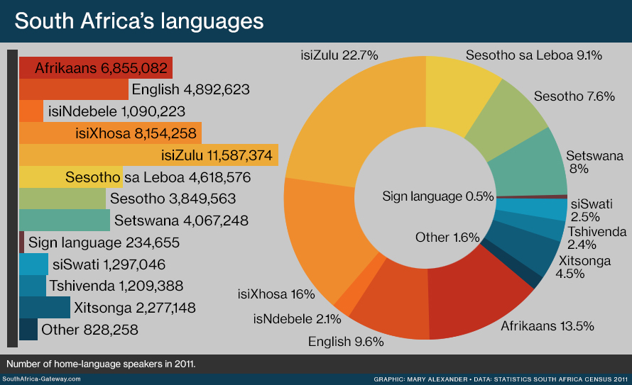

# **South-African-Language-Identification-2022**
my_take

## **Overview**

**[Image Credit](https://bilingua.io/how-to-say-hello-in-100-languages)**

With such a multilingual population, it is only obvious that systems and devices also communicate in multi-languages.

In this challenge, language of text, which is in any of South Africa's 11 Official languages, will be identified. This is an example of NLP's Language Identification, the task of determining the natural language that a piece of text is written in.

## **Dataset**

*The dataset used for this challenge is the NCHLT Text Corpora collected by the South African Department of Arts and Culture & Centre for Text Technology (CTexT, North-West University, South Africa). The training set was improved through additional cleaning done by Praekelt.*

From **[kaggle](https://www.kaggle.com/competitions/south-african-language-identification-hack-2022/data)**

The data is in the form Language ID, Text. The text is in various states of cleanliness. Some NLP techniques will be necessary to clean up the data.

## **File descriptions**

    train_set.csv - the training set
    test_set.csv - the test set
    sample_submission.csv - a sample submission file in the correct format

## **Language IDs**

    afr - Afrikaans
    eng - English
    nbl - isiNdebele
    nso - Sepedi
    sot - Sesotho
    ssw - siSwati
    tsn - Setswana
    tso - Xitsonga
    ven - Tshivenda
    xho - isiXhosa
    zul - isiZulu